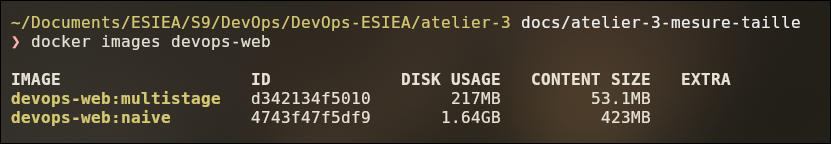
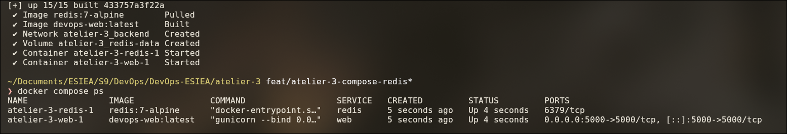
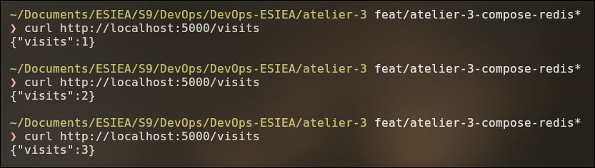
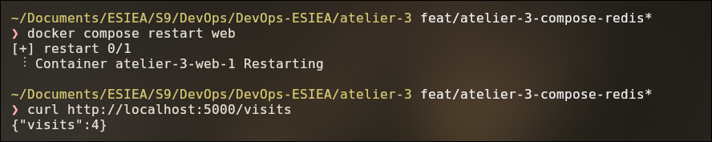
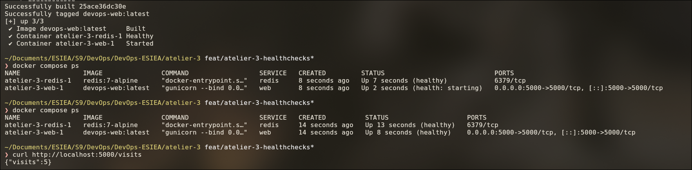
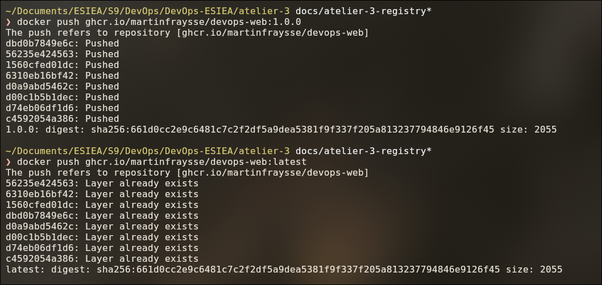
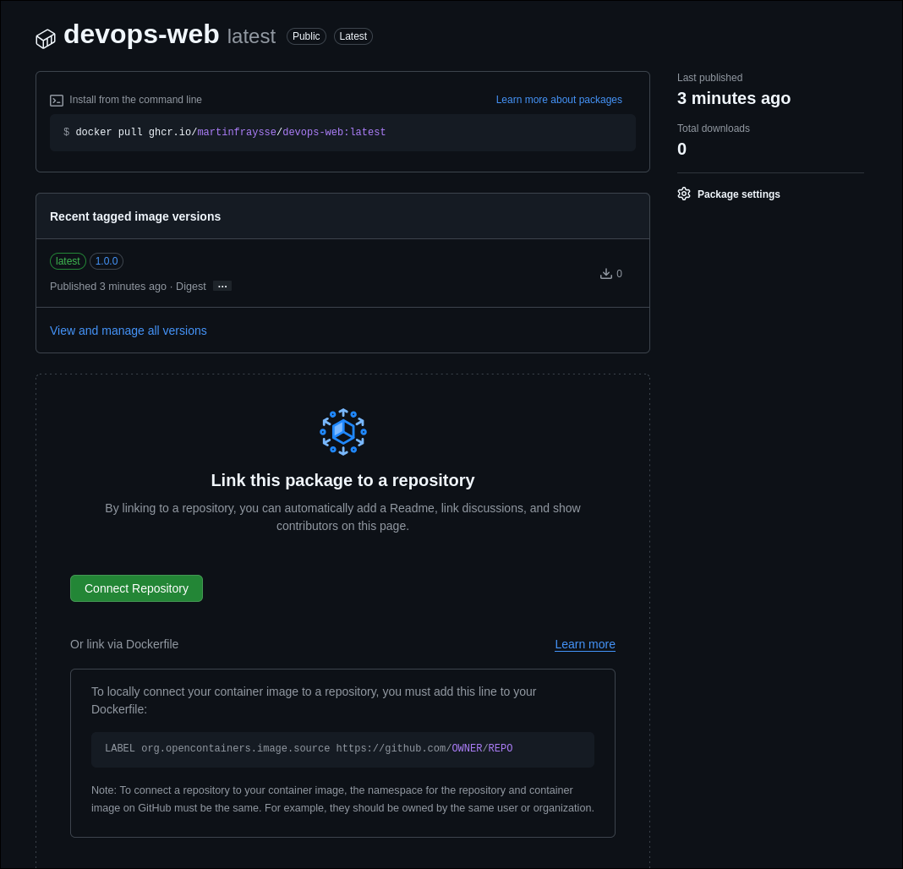
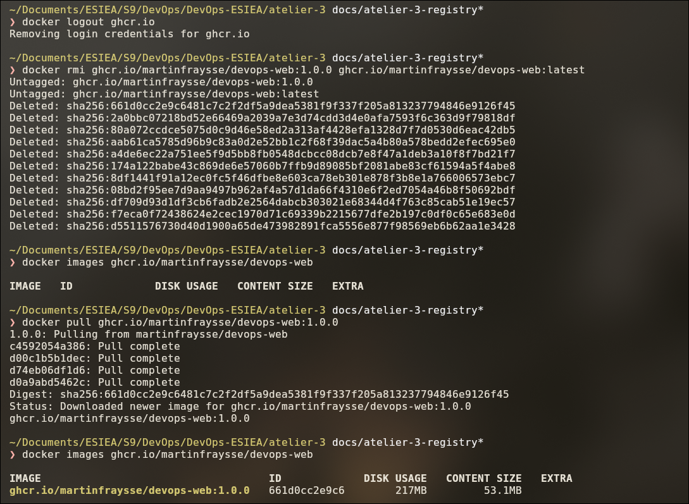

# Atelier 3 — Conteneurisation Docker

Dans cette séance, j'ai mis l'application Flask de la séance 2 dans une image Docker. Ensuite, je l'ai
allégée et sécurisée, je l'ai lancée avec Redis grâce à Docker Compose, et je l'ai publiée sur ghcr.io.

## Lancer le projet

Il faut Docker avec Compose (`docker version` et `docker compose version` doivent répondre).

```bash
git clone https://github.com/MartinFraysse/DevOps-ESIEA.git
cd DevOps-ESIEA/atelier-3

docker compose up -d --build   # construit l'image et lance web + redis
docker compose ps              # après quelques secondes, les 2 services sont "healthy"
```

Pour tester :

```bash
curl http://localhost:5000/health   # {"status":"ok"}
curl http://localhost:5000/visits   # {"visits":1}, puis 2, 3...
```

Pour arrêter : `docker compose down` (le compteur est gardé) ou `docker compose down -v` (le compteur est remis à zéro).

**Construire seulement l'image :** `docker build -t devops-web .`

**Utiliser l'image publiée :** elle est publique sur
[`ghcr.io/martinfraysse/devops-web`](https://github.com/users/MartinFraysse/packages/container/package/devops-web),
avec les tags `1.0.0` et `latest`.

```bash
docker pull ghcr.io/martinfraysse/devops-web:1.0.0
```

**Lancer les tests :** `pip install -r requirements-dev.txt` puis `pytest -v`.

## Fichiers

| Fichier | Rôle |
|---------|------|
| `app.py` | L'application Flask (j'ai ajouté `/visits`) |
| `test_app.py` | Les tests (j'ai ajouté celui de `/visits`) |
| `requirements.txt` | Ce dont l'app a besoin pour tourner : flask, redis, gunicorn |
| `requirements-dev.txt` | En plus, les outils de test et de lint |
| `Dockerfile` | L'image finale (multi-stage) |
| `Dockerfile.naive` | La première version de l'image, gardée pour comparer les tailles |
| `.dockerignore` | Les seuls fichiers envoyés à Docker pendant le build |
| `docker-compose.yml` | Lance `web` et `redis` ensemble |
| `screens/` | Mes captures d'écran pour chaque étape |

## Checklist

| Demandé | Fait | Preuve |
|---------|------|--------|
| Multi-stage, image plus légère, avec des chiffres | 1,64 Go → 217 Mo | Étape 4 |
| Conteneur non-root, vérifié avec `whoami` | `appuser` | Étapes 2 et 3 |
| `.dockerignore` | Oui | Étape 2 |
| `HEALTHCHECK` qui passe `healthy` | Oui | Étape 6 |
| Compose : web + redis, réseau, volume, `service_healthy` | Oui | Étapes 5 et 6 |
| `/visits` garde sa valeur après un restart de `web` | 3 → 4 | Étape 5 |
| Image publiée avec `1.0.0` + `latest`, récupérable depuis zéro | Oui | Étape 7 |
| README avec build et lancement | Oui | Ce fichier |

---

## Étape 1 — Premier Dockerfile

J'ai écrit un Dockerfile très simple : l'image `python:3.12`, je copie le code, j'installe les dépendances et je
lance Flask. Il est gardé dans `Dockerfile.naive`.

**Piège :** par défaut, Flask n'écoute que sur `127.0.0.1`, donc seulement à l'intérieur du conteneur. Même avec
`-p 5000:5000`, on ne peut pas le joindre depuis la machine. J'ai donc lancé Flask avec `--host=0.0.0.0`.

L'image est construite (`docker build -t devops-web:naive .`) :


Le conteneur tourne, avec le port 5000 publié (`docker ps`) :


L'app répond depuis ma machine (`curl` sur `/health` et `/status`) :


## Étape 2 — Non-root et `.dockerignore`

J'ai d'abord mesuré l'image. Elle fait **1,64 Go**. Avec `docker history`, on voit que presque tout ce poids vient
de l'image de base `python:3.12` (par exemple 696 Mo d'outils de compilation). Notre code et nos dépendances ne
pèsent qu'environ 30 Mo. Et le conteneur tournait en `root`.

J'ai corrigé deux choses :

- **Un utilisateur `appuser`**, activé avec `USER`. Piège : `USER` doit venir **après** le `pip install`, sinon
  l'installation n'a pas les droits et le build plante.
- **Un `.dockerignore`** qui bloque tout sauf `app.py` et les `requirements`. Comme ça, `.git`, `.env` ou `.venv`
  ne peuvent pas finir dans l'image.

Avant : taille de l'image, couches, et `whoami` qui répond `root` :


Après : `whoami` répond `appuser`, `/app` ne contient que le nécessaire, et l'app marche toujours :


## Étape 3 — Multi-stage et gunicorn

J'ai réécrit le `Dockerfile` en deux parties :

1. **`builder`** (`python:3.12`) : installe les dépendances dans un dossier `/opt/venv`.
2. **Image finale** (`python:3.12-slim`) : récupère seulement `/opt/venv` avec `COPY --from=builder`, puis `app.py`.

Tout le reste du builder (compilateurs, cache...) n'est pas dans l'image finale.

J'ai aussi remplacé le serveur de dev de Flask par **gunicorn**, qui est fait pour la production. J'ai sorti les
outils de test de `requirements.txt` pour ne pas les mettre dans l'image.

**Piège :** chaque stage repart de zéro. La variable `PATH` déclarée dans le builder n'existe plus dans l'image
finale, donc je l'ai redéclarée. Sans ça, `gunicorn` n'est pas trouvé.

gunicorn démarre, le conteneur tourne en `appuser` et `/health` répond (`docker logs`, `whoami`, `curl`) :


## Étape 4 — Comparaison des tailles

J'ai reconstruit les deux images de zéro (`--no-cache`) juste avant de les comparer :

```bash
docker build --no-cache -f Dockerfile.naive -t devops-web:naive .
docker build --no-cache -t devops-web:multistage .
docker images devops-web
```

| Image | Taille |
|-------|--------|
| Naïve (étapes 1-2) | **1,64 Go** |
| Multi-stage (étape 3) | **217 Mo** |

L'image est **87 % plus légère**. La plus grosse différence vient de l'image `slim`, qui n'a pas les outils de
compilation. Le reste vient des outils de test qu'on n'installe plus.



## Étape 5 — Docker Compose avec Redis

J'ai ajouté une route `/visits` qui compte les visites. Le compteur est stocké dans Redis. Comme ça, il ne repart
pas de zéro quand l'app redémarre. La fonction `get_redis_client()` n'était pas dans le zip, alors je l'ai écrite.

Le `docker-compose.yml` lance deux services :

- **`web`** : notre image, sur le port 5000 ;
- **`redis`** : l'image officielle `redis:7-alpine`, sans port publié car seul `web` a besoin de la joindre.

Ils sont sur un **réseau `backend`**. `web` trouve Redis avec son nom : `redis`. On ne peut pas utiliser
`localhost`, car ça désigne le conteneur `web` lui-même. Les données Redis sont dans un **volume `redis-data`**,
donc elles restent même si on arrête les conteneurs.

Le réseau et le volume sont créés, et les 2 services tournent (`docker compose up`, puis `docker compose ps`) :



Le compteur augmente à chaque appel :



Après `docker compose restart web`, le compteur continue à 4 au lieu de repartir à 1 :



## Étape 6 — Healthchecks

`depends_on` lance Redis avant `web`, mais ne vérifie pas que Redis est vraiment prêt. J'ai donc ajouté :

- un **`HEALTHCHECK`** dans le `Dockerfile`, qui appelle `/health`. Il utilise Python, car `curl` n'existe pas
  dans l'image slim ;
- un **healthcheck sur Redis** avec `redis-cli ping` ;
- **`condition: service_healthy`** : `web` attend que Redis soit prêt avant de démarrer.

Au démarrage, `web` attend que Redis soit `Healthy`. Il est d'abord en `health: starting`, puis `healthy` après
quelques secondes. Le compteur est toujours là grâce au volume :



## Étape 7 — Publication sur ghcr.io

J'ai publié l'image sur ghcr.io avec deux tags :

- **`1.0.0`** : une version fixe, pour pouvoir y revenir si besoin ;
- **`latest`** : la dernière version.

```bash
docker login ghcr.io -u MartinFraysse   # avec un token GitHub (droit write:packages)
docker build -t ghcr.io/martinfraysse/devops-web:1.0.0 .
docker tag ghcr.io/martinfraysse/devops-web:1.0.0 ghcr.io/martinfraysse/devops-web:latest
docker push ghcr.io/martinfraysse/devops-web:1.0.0
docker push ghcr.io/martinfraysse/devops-web:latest
```

Deux pièges : le nom doit être en **minuscules**, et le package est **privé par défaut**. Je l'ai donc passé en
public dans ses paramètres.

Les deux tags sont envoyés et ont le même digest, donc c'est bien la même image :



Le package est public, avec les tags `latest` et `1.0.0` :



Pour vérifier qu'on peut la récupérer depuis zéro, je me suis déconnecté (`docker logout`), j'ai supprimé l'image,
puis je l'ai retéléchargée avec `docker pull`. Ça marche, avec le même digest :


