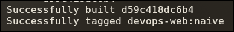
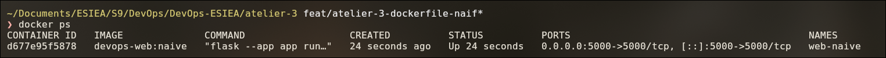
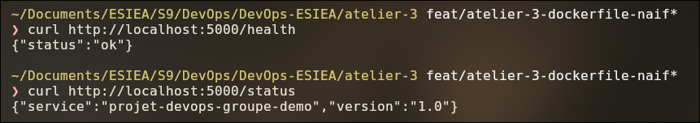
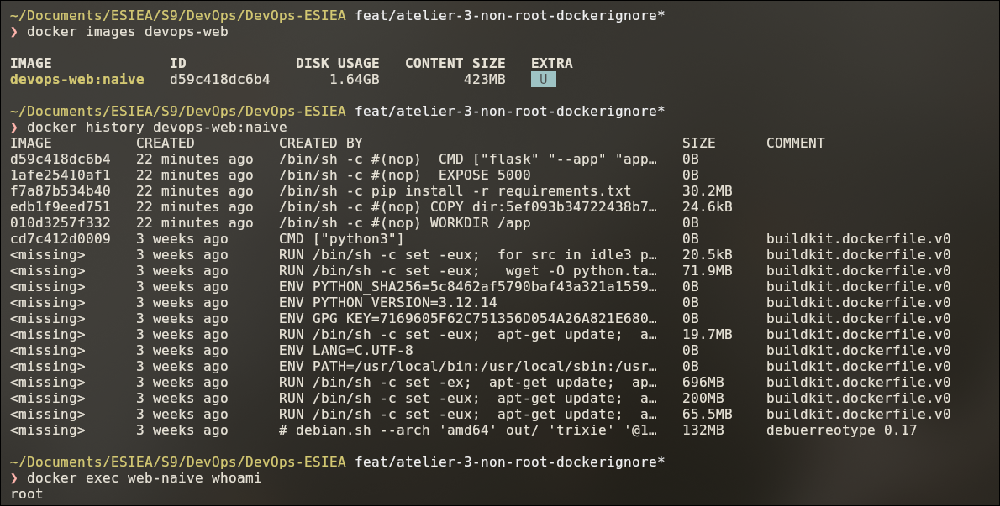
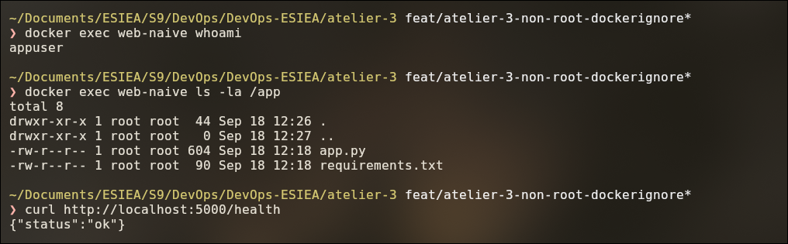
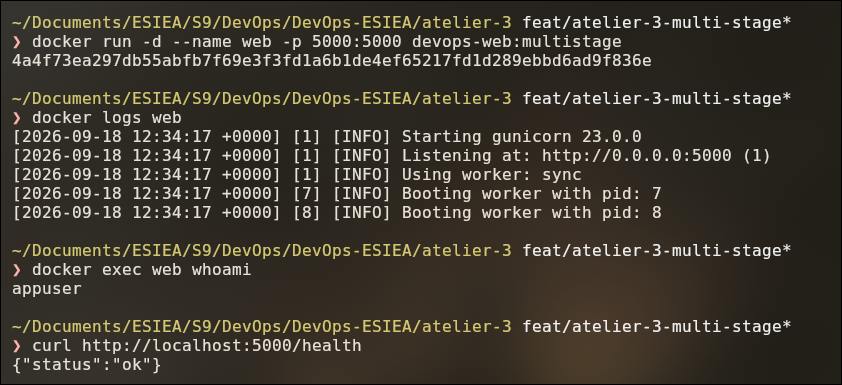

# Atelier 3 — Conteneurisation Docker

Séance 3 du Bloc DevOps. Objectif : conteneuriser l'application Flask de la séance 2, optimiser l'image
(non-root, multi-stage), orchestrer `web` + `redis` avec Docker Compose et publier l'image sur un registry.

## Contenu du dossier

| Chemin | Rôle |
|--------|------|
| `app.py` | Application Flask fournie (starter-app) : `alert_threshold`, `sanitize_input`, `/health`, `/status` |
| `test_app.py` | Tests unitaires pytest fournis |
| `requirements.txt` | Dépendances d'exécution, embarquées dans l'image : flask, redis, gunicorn |
| `requirements-dev.txt` | Dépendances de développement (tests, lint), en plus des précédentes |
| `.flake8` | Configuration du lint (`max-line-length = 100`) |
| `Dockerfile` | Image de l'application, build multi-stage (étape 3) |
| `Dockerfile.naive` | Image naïve des étapes 1-2, conservée pour la comparaison de taille |
| `.dockerignore` | Liste blanche des fichiers envoyés au build (étape 2) |
| `screens/` | Captures d'écran servant de preuves pour chaque étape |

## Étape 1 — Premier Dockerfile naïf

Premier jet volontairement simple : une seule étape, image complète `python:3.12`, on copie le code, on installe
les dépendances, on démarre l'application.

```dockerfile
FROM python:3.12
WORKDIR /app
COPY . .
RUN pip install -r requirements.txt
EXPOSE 5000
CMD ["flask", "--app", "app", "run", "--host=0.0.0.0", "--port=5000"]
```

**Piège évité :** le `app.run(debug=True)` de `app.py` écoute par défaut sur `127.0.0.1`, c'est-à-dire
uniquement à l'intérieur du conteneur. Le conteneur tournerait sans erreur mais resterait injoignable depuis
l'hôte, même avec `-p`. On démarre donc Flask avec `--host=0.0.0.0` pour écouter sur toutes les interfaces
du conteneur.

```bash
cd atelier-3
docker build -t devops-web:naive .
docker run -d --name web-naive -p 5000:5000 devops-web:naive
curl http://localhost:5000/health
```

### Preuves

| Fichier | Origine | Ce qu'il montre |
|---------|---------|-----------------|
| [`etape1-docker-build.png`](screens/etape1-docker-build.png) | Fin de `docker build -t devops-web:naive .`, depuis `atelier-3/` | Image construite et taguée `devops-web:naive` |
| [`etape1-docker-ps.png`](screens/etape1-docker-ps.png) | `docker ps`, après `docker run -d --name web-naive -p 5000:5000 devops-web:naive` | Conteneur `Up`, port publié `0.0.0.0:5000->5000/tcp` |
| [`etape1-curl-health-status.png`](screens/etape1-curl-health-status.png) | `curl http://localhost:5000/health` et `/status`, lancés **depuis l'hôte** | `{"status":"ok"}` et le JSON de `/status` : l'application est joignable hors du conteneur |







## Étape 2 — Mesurer, utilisateur non-root, `.dockerignore`

### Mesure de l'image naïve

`docker images` : **1,64 Go** sur disque (423 Mo compressés). `docker history` montre que l'essentiel du poids
vient de l'image de base `python:3.12`, pas de notre application :

| Couche | Taille | Origine |
|--------|--------|---------|
| `apt-get install` (compilateurs, en-têtes, outils de build) | 696 Mo | image de base |
| `apt-get install` (outils système) | 200 Mo | image de base |
| Debian `trixie` (système de base) | 132 Mo | image de base |
| Python 3.12 compilé | 71,9 Mo | image de base |
| `pip install -r requirements.txt` | 30,2 Mo | notre Dockerfile |
| `COPY . .` | 24,6 ko | notre Dockerfile |

Conclusion : ce n'est pas le code qu'il faut alléger mais l'image de base, pleine d'outils de compilation
inutiles à l'exécution. C'est l'objet du multi-stage avec une image slim (étape 3).

`docker exec web-naive whoami` répond **`root`** : le processus de l'application tourne avec tous les droits dans
le conteneur.

### Corrections

**Utilisateur non-root** — ajouté au `Dockerfile` :

```dockerfile
RUN pip install -r requirements.txt
RUN useradd --create-home --uid 1000 appuser
USER appuser
```

Piège de l'ordre : `USER` doit venir **après** `pip install`. Placé avant, l'installation s'exécuterait en
`appuser`, qui n'a pas le droit d'écrire dans le `site-packages` système, et le build échouerait. Les fichiers de
`/app` restent propriété de `root` : `appuser` peut les lire et les exécuter, mais pas les modifier.

**`.dockerignore`** — en liste blanche : tout est exclu, seuls les fichiers nécessaires à l'exécution sont
réautorisés. Rien d'autre (`.git`, `.env`, `.venv`, caches, tests, captures) ne peut entrer dans l'image, même si
un nouveau fichier est ajouté au dossier plus tard.

```
*
!app.py
!requirements.txt
```

### Preuves

| Fichier | Origine | Ce qu'il montre |
|---------|---------|-----------------|
| [`etape2-avant-images-history-whoami.png`](screens/etape2-avant-images-history-whoami.png) | `docker images devops-web`, `docker history devops-web:naive`, `docker exec web-naive whoami` — image de l'étape 1 | Taille 1,64 Go, poids des couches, conteneur en `root` |
| [`etape2-apres-whoami-ls-health.png`](screens/etape2-apres-whoami-ls-health.png) | Après rebuild : `docker exec web-naive whoami`, `docker exec web-naive ls -la /app`, `curl http://localhost:5000/health` | Processus en `appuser` ; `/app` ne contient que `app.py` et `requirements.txt` (appartenant à `root`) ; l'app répond toujours |





## Étape 3 — Multi-stage build et gunicorn

Le Dockerfile naïf est conservé sous `Dockerfile.naive` ; le `Dockerfile` est réécrit en deux stages :

| Stage | Image | Rôle |
|-------|-------|------|
| `builder` | `python:3.12` (complète) | Crée un venv dans `/opt/venv` et y installe les dépendances |
| final | `python:3.12-slim` | Récupère **uniquement** `/opt/venv` via `COPY --from=builder`, plus `app.py` |

L'image finale n'hérite de rien d'autre du builder : ni compilateurs, ni outils de build, ni cache pip
(`--no-cache-dir`).

**Piège évité :** chaque stage a son propre environnement. Le `ENV PATH="/opt/venv/bin:$PATH"` du builder n'existe
plus dans le stage final ; il est redéclaré, sinon `gunicorn` serait introuvable au démarrage.

**Serveur WSGI :** le serveur de développement Flask est remplacé par `gunicorn` (2 workers). Le serveur intégré
de Flask n'est pas conçu pour la production (mono-processus, mode debug exposant une console d'exécution de code).

**Dépendances séparées :** `requirements.txt` ne contient plus que ce qui sert à l'exécution (flask, redis,
gunicorn). Les outils de test et de lint passent dans `requirements-dev.txt`, qui n'est pas installé dans l'image.

```bash
cd atelier-3
docker build -t devops-web:multistage .
docker run -d --name web -p 5000:5000 devops-web:multistage
```

Pour le développement local : `pip install -r requirements-dev.txt`.

### Preuves

| Fichier | Origine | Ce qu'il montre |
|---------|---------|-----------------|
| [`etape3-run-gunicorn-whoami-health.png`](screens/etape3-run-gunicorn-whoami-health.png) | `docker run -d --name web -p 5000:5000 devops-web:multistage`, puis `docker logs web`, `docker exec web whoami`, `curl http://localhost:5000/health` | L'app tourne sous **gunicorn 23.0.0** (2 workers, plus de warning « development server »), en `appuser`, et répond sur `/health` |


