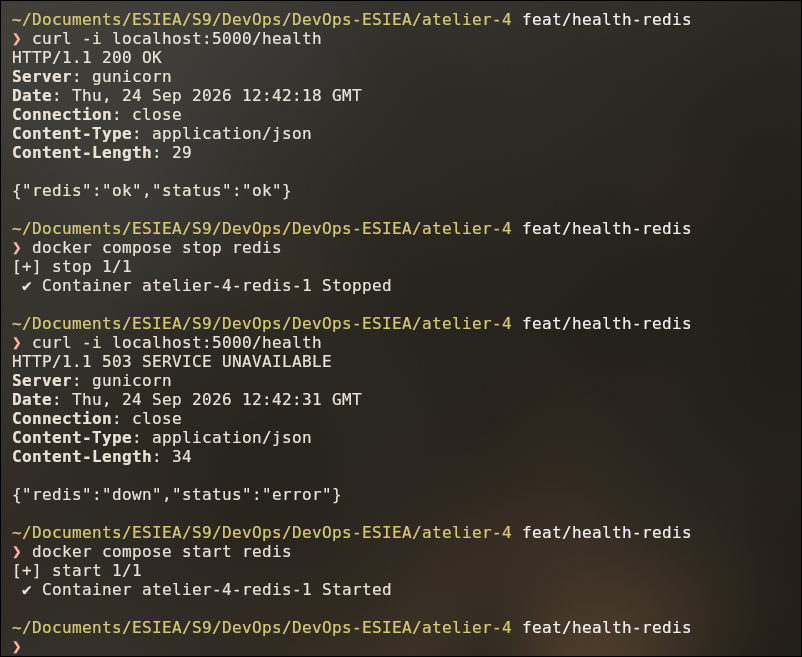
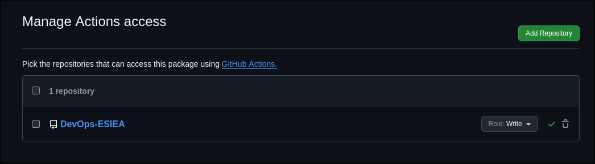

# Atelier 4 — Pipeline CI/CD de bout en bout

Point de départ : les fichiers finaux de l'atelier 3 (app Flask + Redis, Dockerfile multi-stage, docker-compose).

Le compte rendu complet de la séance sera ajouté ici à la fin de l'atelier.

## Étape 1 — Un `/health` qui vérifie vraiment quelque chose

Avant, `/health` renvoyait toujours `200`, même si Redis était arrêté. Le script de déploiement va se servir de
`/health` pour savoir si une nouvelle version marche : avec un `200` fixe, une version cassée serait mise en
production comme une bonne.

Maintenant, `/health` envoie un `PING` à Redis :

- Redis répond → **200** `{"redis":"ok","status":"ok"}`
- Redis ne répond pas → **503** `{"redis":"down","status":"error"}`

J'ai ajouté un timeout de 2 secondes sur la connexion à Redis. Sans ça, `/health` peut rester bloqué au lieu de
renvoyer 503.

Côté tests, le test de `/health` utilise maintenant `fakeredis` (il n'y a pas de Redis dans la CI), et j'ai ajouté
un test qui vérifie le 503 avec un faux Redis en panne.

Test en vrai : `200` avec Redis démarré, puis `503` après `docker compose stop redis` :

## Étape 2 — Job `build-and-push`

J'ai ajouté un 3e job à la CI : `build-and-push`. Il construit l'image Docker (le Dockerfile multi-stage de
l'atelier 3) et la pousse sur ghcr.io avec deux tags :

- **le SHA du commit** : il ne bouge jamais, donc on sait exactement quelle version tourne ;
- **`latest`** : toujours la dernière image, il change à chaque push.

Le job attend que `test` soit vert (`needs: test`) et ne tourne que sur un push sur `main`. Sur une pull request
il est `skipped`, pour ne pas publier une image à chaque PR.

Deux points de config à ne pas oublier :

- `permissions: packages: write` dans le job, sinon le `GITHUB_TOKEN` n'a pas le droit de pousser l'image ;
- le package `devops-web` avait été créé à la main à l'atelier 3, donc il a fallu autoriser le dépôt dans
  *Package settings → Manage Actions access* (rôle **Write**), sinon erreur 403.

Le Dockerfile reçoit aussi le SHA du commit (`--build-arg GIT_SHA`), il servira à l'étape 8.
