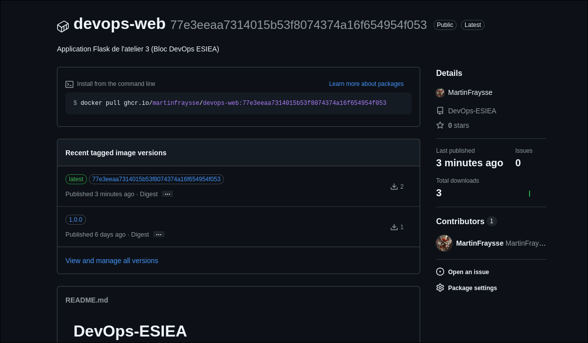
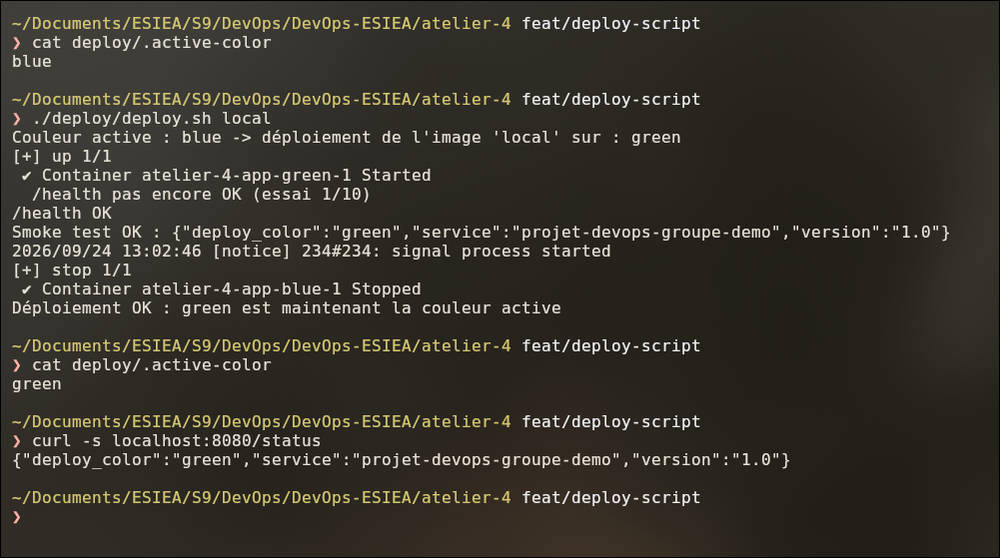
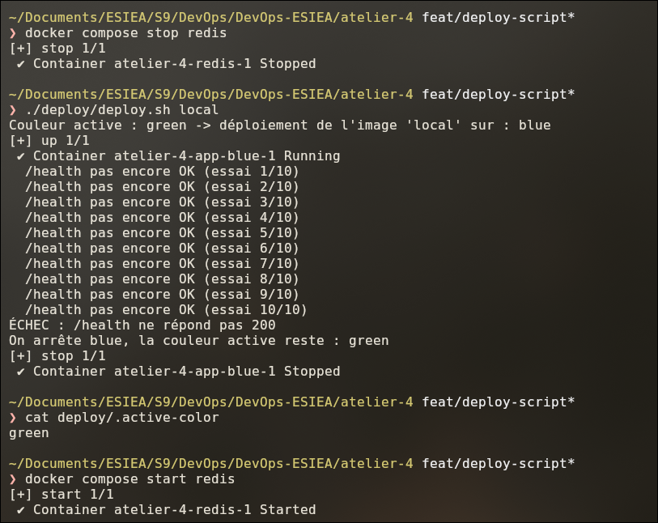
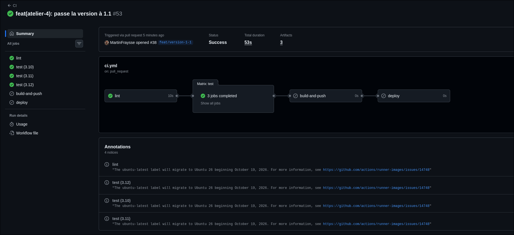
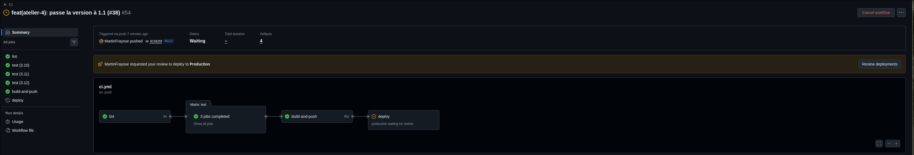
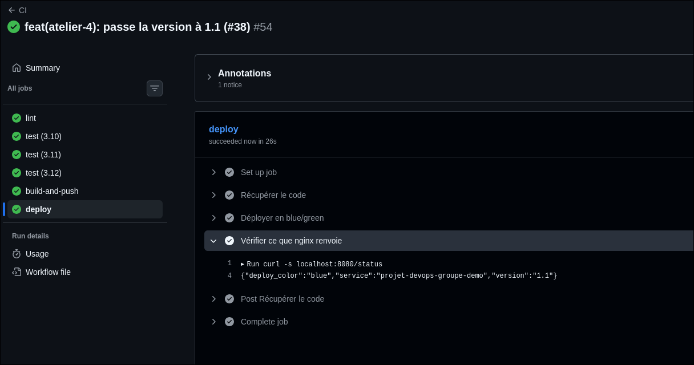
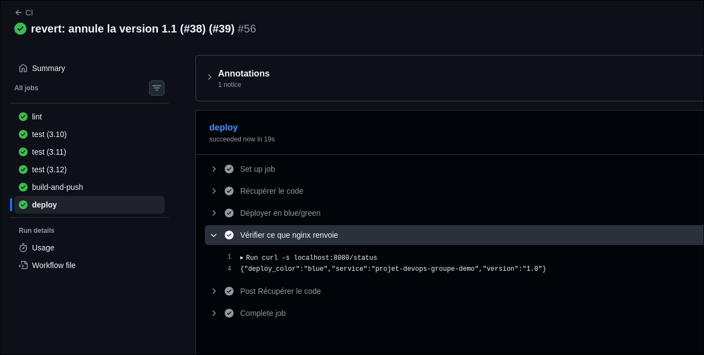
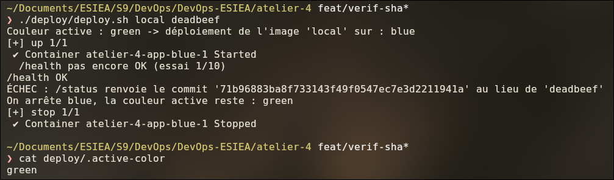

# Atelier 4 — Pipeline CI/CD de bout en bout

Dans cette séance, j'ai continué la CI de la séance 2 pour qu'un push sur `main` aille jusqu'au déploiement.
L'image Docker est construite, envoyée sur ghcr.io, puis déployée en blue/green. Si la nouvelle version ne marche
pas, on garde l'ancienne. Je suis parti du code de l'atelier 3.

## Le pipeline

```
lint  ->  test (3.10, 3.11, 3.12)  ->  build-and-push  ->  deploy
```

- `lint` et `test` : comme à la séance 2. Ils tournent sur les PR et sur `main`.
- `build-and-push` : construit l'image et la met sur ghcr.io avec 2 tags, le SHA du commit et `latest`.
- `deploy` : lance `deploy/deploy.sh`. Il attend que j'approuve avant de partir.

`build-and-push` et `deploy` ne tournent que sur un push sur `main`. Sur une PR, ils sont `skipped`.

## Le déploiement blue/green

Il y a deux fois la même app : `app-blue` et `app-green`. nginx envoie le trafic vers une seule des deux.

Pour déployer, le script lance la nouvelle version sur la couleur qui ne sert pas, et il la teste. Si elle marche,
nginx passe dessus et l'ancienne est arrêtée. Sinon, le script arrête la nouvelle et rien ne change.

Il y a 2 façons de revenir en arrière :

- **automatique** : si la nouvelle version ne répond pas bien, le script ne bascule pas (étapes 4 et 8) ;
- **manuelle** : si on voit un problème après le déploiement, on fait un `git revert` et le pipeline redéploie
  l'ancienne version (étape 7).

**Limite :** en CI, le job `deploy` tourne à chaque fois sur une machine neuve. La « production » repart donc de
zéro à chaque déploiement. La vraie bascule entre blue et green, je l'ai testée en local.

## Lancer en local

Il faut Docker, Docker Compose et `jq`.

```bash
cd atelier-4
docker build --build-arg GIT_SHA=$(git rev-parse HEAD) -t ghcr.io/martinfraysse/devops-web:local .
./deploy/deploy.sh local "$(git rev-parse HEAD)"    # 1er déploiement, sur blue
curl localhost:8080/status
./deploy/deploy.sh local "$(git rev-parse HEAD)"    # relancer = bascule sur green
```

Pour tout arrêter : `docker compose --profile blue --profile green down`.

Pour les tests : `pip install -r requirements-dev.txt` puis `pytest -v`.

## Fichiers

| Fichier | Rôle |
|---------|------|
| `app.py` | L'app Flask |
| `test_app.py` | Les tests |
| `Dockerfile` | L'image (celle de l'atelier 3 + le SHA du commit) |
| `docker-compose.yml` | redis, nginx, app-blue et app-green |
| `deploy/deploy.sh` | Le script de déploiement |
| `deploy/nginx/app.conf.template` | Le modèle de config nginx |
| `screens/` | Mes captures d'écran |

Le pipeline est dans `.github/workflows/ci.yml`, à la racine du dépôt.

## Checklist

| Demandé | Fait | Preuve |
|---------|------|--------|
| 4 jobs `lint` → `test` → `build-and-push` → `deploy` | Oui | Étape 5 |
| Image sur ghcr.io avec le tag SHA + `latest` | Oui | Étape 2 |
| Blue/green en local avec une vraie bascule | blue → green | Étape 4 |
| Rollback automatique testé | Redis coupé | Étape 4 |
| Job `deploy` dans `environment: production` | Oui | Étape 5 |
| Un vrai push jusqu'au déploiement | Version 1.1 | Étape 6 |
| Rollback manuel avec `git revert` | Retour à 1.0 | Étape 7 |
| `/health` vérifie Redis | 200 / 503 | Étape 1 |
| `/status` donne le SHA, vérifié par le script | SHA faux refusé | Étape 8 |
| README | Oui | Ce fichier |

---

## Étape 1 — `/health`

Avant, `/health` répondait toujours `200`, même avec Redis arrêté. Ça pose problème parce que le script de
déploiement se sert de `/health` pour savoir si la nouvelle version marche.

Maintenant `/health` fait un `ping` sur Redis : `200` si Redis répond, `503` sinon. J'ai mis un timeout de
2 secondes, sinon la requête peut rester bloquée.

Pour les tests, j'utilise `fakeredis` (il n'y a pas de Redis dans la CI) et j'ai ajouté un test pour le cas 503.


## Étape 2 — Job `build-and-push`

Nouveau job dans la CI. Il se lance après `test`, seulement sur `main`, et pousse l'image sur ghcr.io avec :

- le tag du SHA du commit, qui ne change jamais : on sait quelle version tourne ;
- le tag `latest`, qui change à chaque push.

Il faut `permissions: packages: write` dans le job. Comme j'avais créé le package à la main à l'atelier 3, j'ai
aussi dû donner l'accès au dépôt dans les réglages du package, sinon erreur 403 :


L'image est bien publiée avec les 2 tags :



## Étape 3 — Blue/green avec Docker Compose

Le `docker-compose.yml` a maintenant 4 services :

- `redis` et `nginx` : ils démarrent toujours ;
- `app-blue` et `app-green` : ils démarrent seulement avec `--profile blue` ou `--profile green`.

Les apps n'ont plus de port ouvert, tout passe par nginx sur le port 8080. `/status` renvoie aussi la couleur
(`deploy_color`), comme ça on voit vers quelle app nginx envoie le trafic.

La config nginx est créée à partir de `deploy/nginx/app.conf.template` en remplaçant `COLOR` par `blue` ou
`green`. J'ai eu deux problèmes :

- nginx ne démarrait pas si l'app n'était pas encore lancée. J'ai réglé ça avec `resolver` et une variable dans
  `proxy_pass` ;
- il faut monter le dossier `deploy/nginx` et pas juste le fichier, sinon nginx ne voit pas les changements.

## Étape 4 — Script de déploiement

`deploy/deploy.sh` fait ça :

1. il lit la couleur active dans `deploy/.active-color` ;
2. il lance la nouvelle version sur l'autre couleur ;
3. il attend que `/health` réponde (10 essais, toutes les 3 secondes), puis vérifie `/status` ;
4. si c'est bon : il change la config nginx, fait `nginx -s reload`, puis arrête l'ancienne couleur. Il faut
   faire dans cet ordre, sinon plus rien ne répond pendant un moment ;
   si ce n'est pas bon : il arrête la nouvelle version, et la couleur active ne change pas.

J'ai mis `--no-deps` pour lancer la nouvelle couleur, sinon Compose relance Redis tout seul et je ne pouvais pas
tester le cas où Redis est coupé. J'ai vérifié le script avec `shellcheck`.

Déploiement qui marche (blue → green) :



Déploiement qui rate (Redis coupé) : le script abandonne et `green` reste active :



## Étape 5 — Job `deploy`

Le job `deploy` se lance après `build-and-push` et appelle `deploy.sh` avec le SHA du commit. Il est dans un
`environment: production`, et dans les réglages GitHub j'ai mis une approbation obligatoire : le déploiement
attend que je valide.

Comme la machine de la CI est neuve à chaque fois, `deploy.sh` démarre aussi redis et nginx, et télécharge l'image
depuis ghcr.io.

Sur une PR, `build-and-push` et `deploy` ne tournent pas :



Sur `main`, les 4 jobs s'enchaînent et `deploy` attend l'approbation :



## Étape 6 — Test complet

J'ai changé la version dans `/status` : `1.0` → `1.1` (PR #38). Après le merge, tout s'est lancé tout seul, j'ai
juste approuvé le déploiement. Dans les logs de `deploy`, on voit bien la version 1.1 :



## Étape 7 — Rollback avec `git revert`

On fait comme si on trouvait un bug dans la 1.1 après le déploiement. Le rollback automatique ne peut rien faire,
la 1.1 marchait bien au moment du déploiement. Donc j'annule le commit avec Git :

```bash
git log --oneline -5              # le commit à annuler : 815826f
git switch -c revert/version-1-1
git revert 815826f
git show HEAD                     # je vérifie le diff avant de pousser
git push -u origin revert/version-1-1
```

Le diff ne change qu'une ligne (`1.1` → `1.0`). Après la PR #39, le pipeline redéploie et on est revenu à 1.0 :



## Étape 8 — Vérifier le SHA

Avant, le script vérifiait seulement la couleur. Ça ne prouvait pas que c'était le bon code qui tournait.

Maintenant la CI met le SHA du commit dans l'image au moment du build (`--build-arg GIT_SHA`), et `/status` le
renvoie dans `commit`. `deploy.sh` prend le SHA attendu en 2e argument et compare. Si ce n'est pas le même, le
déploiement est annulé comme pour un `/health` cassé.

Le SHA doit être mis au build et pas au déploiement : sinon le script comparerait le SHA avec lui-même et le test
serait toujours bon.

Avec un faux SHA, le déploiement est refusé et `green` reste active :


