# Atelier 5 — Observabilité (Prometheus & Grafana)

Dans cette séance, j'ai ajouté des métriques à l'app Flask, puis Prometheus pour les récupérer et Grafana pour
les afficher. Il y a aussi une alerte quand l'app renvoie trop d'erreurs. Je suis parti du code de l'atelier 4.

## En bref

```bash
cd atelier-5
cp .env.example .env              # optionnel : pour changer le mot de passe de Grafana
docker compose up -d --build      # lance web + redis + prometheus + grafana
./trafic.sh                       # envoie du trafic pendant 60 s (./trafic.sh erreur pour des erreurs)
```

| Quoi | Où | Pour quoi faire |
|------|----|-----------------|
| L'app | http://localhost:5000 | `/health`, `/status`, `/visits`, `/simulate-error` |
| Les métriques brutes | http://localhost:5000/metrics | ce que Prometheus lit |
| Prometheus | http://localhost:9090 | `/targets` (l'app est-elle UP ?), `/alerts`, onglet Graph |
| Grafana | http://localhost:3000 | login `admin` / `admin` (ou ce qui est dans `.env`) |

- **Dashboard :** dans Grafana, *Dashboards → Atelier 5 - App Flask*. Il montre le nombre de requêtes par
  seconde pour chaque endpoint, le pourcentage d'erreurs (ligne rouge à 5 %) et la latence p95 par endpoint.
- **Alerte :** `TauxErreurEleve` passe en `firing` si plus de **5 %** des réponses sont des erreurs 5xx
  pendant au moins **30 secondes**. On la voit dans Prometheus, onglet *Alerts*.
- La datasource et le dashboard sont créés au démarrage à partir des fichiers de `grafana/` : un
  `docker compose down -v` ne les perd pas. Pour changer le dashboard, on modifie `grafana/dashboards/app.json`.

Pour tout arrêter : `docker compose down` (ajouter `-v` pour effacer aussi les données).

## Comment ça marche

```
navigateur :5000            :9090                         :3000
    │                          │                             │
    ▼        lit /metrics      ▼        requêtes PromQL      ▼
  web  ◄──────────────────  prometheus  ◄───────────────  grafana
   │     toutes les 5 s      (garde l'historique,          (dashboard)
   ▼                          vérifie l'alerte)
 redis
```

Entre les conteneurs, on utilise le nom du service (`web`, `prometheus`) et pas `localhost`.

## Fichiers

| Fichier | Rôle |
|---------|------|
| `app.py` | L'app Flask, avec les métriques et `/metrics` |
| `test_app.py` | Les tests |
| `docker-compose.yml` | web, redis, prometheus et grafana |
| `prometheus/prometheus.yml` | Ce que Prometheus doit lire (`web:5000`) |
| `prometheus/alerts.yml` | La règle d'alerte |
| `grafana/provisioning/` | La datasource et le « provider » qui charge le dashboard |
| `grafana/dashboards/app.json` | Le dashboard |
| `trafic.sh` | Envoie du trafic (normal ou avec erreurs) |
| `docker-compose.deploy.yml`, `deploy/` | Le blue/green de l'atelier 4, utilisé par la CI |
| `screens/` | Mes captures d'écran |

## Checklist

| Demandé | Fait | Preuve |
|---------|------|--------|
| Compteur de requêtes avec labels méthode / endpoint / code | Oui | Étape 1 |
| `/metrics` ne se compte pas lui-même | Oui, + test | Étape 1 |
| Histogramme de latence | Oui | Étape 2 |
| `/simulate-error` | Renvoie 500 | Étape 2 |
| Prometheus dans le compose, cible `UP` | Oui | Étape 3 |
| Fichier de règles préparé dès l'étape 3 | `alerts.yml` vide | Étape 3 |
| PromQL : brut, `rate()`, `sum by` | Oui | Étape 4 |
| Grafana avec datasource provisionnée | Oui | Étape 5 |
| Mot de passe Grafana par variable d'environnement | `.env` | Étape 5 |
| Dashboard provisionné en JSON, 3 panneaux | Débit, erreurs, p95 | Étape 6 |
| Alerte > 5 % pendant 30 s | `TauxErreurEleve` | Étape 7 |
| États `inactive` → `pending` → `firing` observés | Oui | Étape 7 |
| README | Oui | Ce fichier |

---

## Préparation

J'ai copié l'atelier 4 dans `atelier-5/` et la CI tourne maintenant sur ce dossier.

J'ai séparé les fichiers Compose comme dans le starter du prof :

- `docker-compose.yml` : l'app construite en local, Redis, et ensuite Prometheus et Grafana ;
- `docker-compose.deploy.yml` : le blue/green de l'atelier 4. `deploy.sh` utilise ce fichier.

Avec le blue/green, une des deux couleurs est toujours arrêtée, donc Prometheus aurait toujours une cible `DOWN`.
Avec un seul service `web`, c'est plus simple.

## Étape 1 — Compteur de requêtes

J'ai ajouté `prometheus-client` et un `Counter` appelé `http_requests_total`, avec 3 labels : `method`,
`endpoint` et `status`. Il est incrémenté dans un `after_request`, donc une seule fois pour toutes les routes.

Pour `endpoint`, je prends la **route** Flask (`/visits`) et pas l'URL tapée. Sinon, chaque URL inventée
(`/azerty`, `/wp-admin`...) créerait une nouvelle série dans Prometheus. Les URL qui n'existent pas sont
toutes regroupées dans `endpoint="unknown"`.

`/metrics` n'est pas compté : Prometheus l'appelle toutes les 5 secondes, le compteur monterait tout seul.

Deux choses que j'ai remarquées :

- gunicorn avait 2 workers. Chaque worker a ses propres compteurs, donc `/metrics` donnait les chiffres d'un
  worker ou de l'autre selon le moment. Je suis passé à 1 worker avec 4 threads ;
- le compteur de `/health` ne part pas de 0 : le `HEALTHCHECK` du Dockerfile appelle `/health` toutes les
  10 secondes.

```bash
curl -s localhost:5000/health > /dev/null
curl -s localhost:5000/metrics | grep ^http_requests_total
```

La valeur monte de 1 à chaque appel :

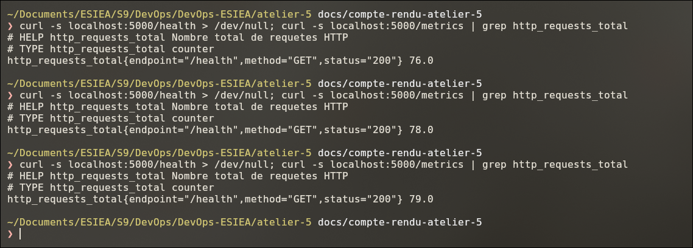

## Étape 2 — Histogramme de latence

Deuxième métrique : `http_request_duration_seconds`, un `Histogram`. Le `before_request` note l'heure de
départ, le `after_request` calcule la durée et l'ajoute à l'histogramme.

Pourquoi pas une moyenne : si 99 requêtes prennent 10 ms et 1 requête prend 2 s, la moyenne est de 30 ms et
tout a l'air normal. Avec un histogramme, on peut calculer le p99 (≈ 2 s) : 1 utilisateur sur 100 attend
2 secondes.

Un histogramme donne 3 familles de séries :

- `_bucket{le="..."}` : combien de requêtes ont pris moins de `le` secondes ;
- `_sum` : le temps total ;
- `_count` : le nombre de requêtes.

J'ai aussi ajouté `/simulate-error`, qui renvoie toujours une erreur 500 (pour l'étape 7).

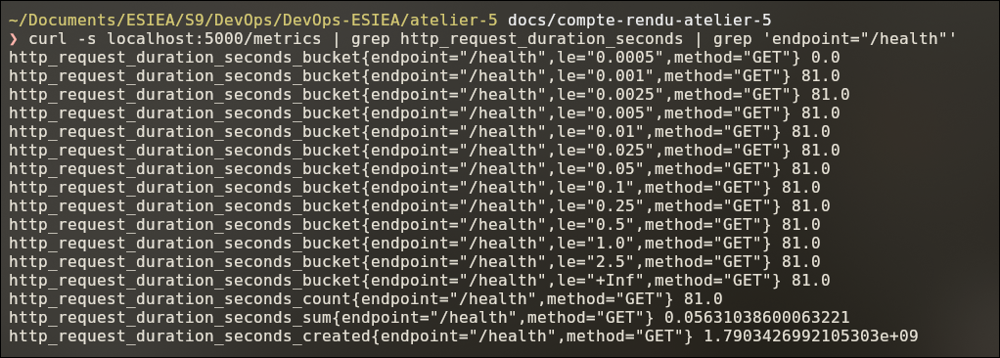

## Étape 3 — Prometheus

J'ai ajouté le service `prometheus` dans `docker-compose.yml`, avec le dossier `prometheus/` monté dans le
conteneur. Prometheus lit `/metrics` toutes les 5 secondes.

La cible est `web:5000`. J'ai essayé avec `localhost:5000` pour voir : la cible est `DOWN` avec
`connect: connection refused`, parce que dans le conteneur Prometheus, `localhost` c'est Prometheus lui-même.

Le fichier `alerts.yml` est déjà là mais vide (`groups: []`), il est rempli à l'étape 7. Pour vérifier la config :

```bash
docker compose exec prometheus promtool check config /etc/prometheus/prometheus.yml
```

La cible est `UP` :

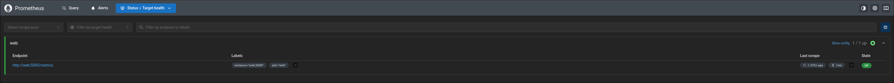

## Étape 4 — PromQL

J'ai lancé `./trafic.sh` et testé 3 requêtes dans l'onglet *Graph* de Prometheus.

**1. La métrique brute :** `http_requests_total`. C'est un compteur, il ne fait que monter (sauf si l'app
redémarre). La courbe est un escalier, ça ne dit pas combien il y a de requêtes en ce moment.

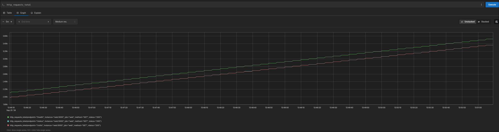

**2. Avec `rate()` :** `rate(http_requests_total[1m])`. `rate()` calcule de combien le compteur monte par
seconde, sur la dernière minute. Là, on a un vrai débit en requêtes par seconde.

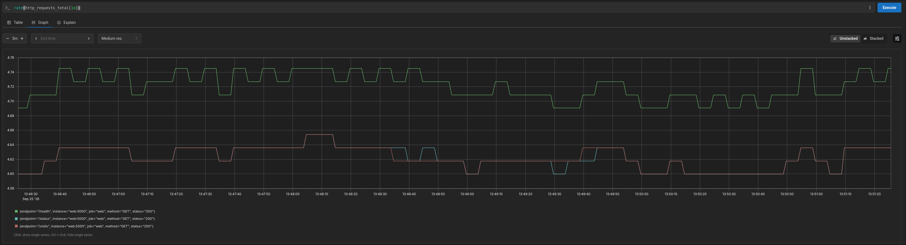

**3. Avec `sum by` :** `sum by (endpoint) (rate(http_requests_total[1m]))`. `rate()` donne une courbe par
combinaison de labels (méthode, endpoint, code), c'est trop. `sum by (endpoint)` les additionne pour avoir
une seule courbe par endpoint.

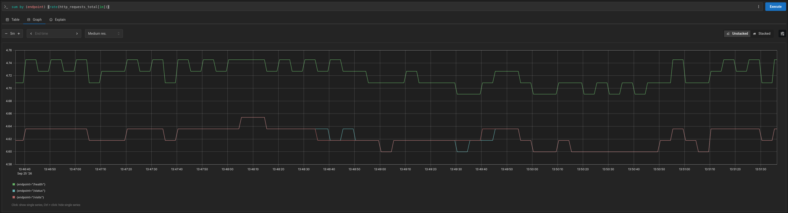

## Étape 5 — Grafana

J'ai ajouté le service `grafana`. La datasource Prometheus est dans
`grafana/provisioning/datasources/prometheus.yml` : Grafana la crée tout seul au démarrage. Si on l'ajoutait
à la main, elle disparaîtrait avec un `docker compose down -v`. L'URL est `http://prometheus:9090` (le nom du
service, comme à l'étape 3).

Le mot de passe admin vient de la variable `GRAFANA_ADMIN_PASSWORD` (dans `.env`, qui n'est pas dans Git), avec
`admin` par défaut pour tester en local.

Après un `docker compose down -v` puis `up`, la datasource est là et le test est bon, sans rien faire :

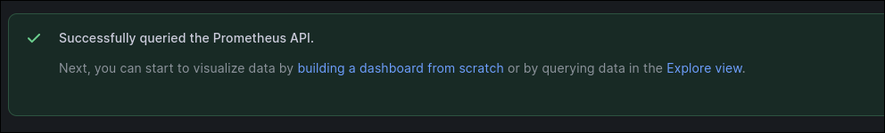

## Étape 6 — Dashboard

Le dashboard est dans `grafana/dashboards/app.json`. Le fichier `grafana/provisioning/dashboards/dashboards.yml`
(le « provider ») dit à Grafana de charger les JSON de ce dossier au démarrage.

| Panneau | Requête |
|---------|---------|
| Débit par endpoint | `sum by (endpoint) (rate(http_requests_total[1m]))` |
| Taux d'erreur | `(sum(rate(http_requests_total{status=~"5.."}[1m])) or vector(0)) / sum(rate(http_requests_total[1m]))` |
| Latence p95 | `histogram_quantile(0.95, sum by (le, endpoint) (rate(http_request_duration_seconds_bucket[1m])))` |

- **Taux d'erreur :** pas besoin d'une métrique en plus, on garde les requêtes avec un `status` en `5..` et on
  divise par le total. Le `or vector(0)` sert à afficher 0 % au lieu de « No data » quand il n'y a encore eu
  aucune erreur.
- **p95 :** `histogram_quantile` utilise les seaux de l'histogramme. Il faut garder `le` dans le `sum by`, sinon
  il ne sait plus quel seau est lequel.

**Problème :** au début, le p95 valait 4,75 ms pour tous les endpoints. Nos requêtes prennent moins de 5 ms,
et le plus petit seau par défaut est 5 ms : tout tombait dans le premier seau. J'ai ajouté des seaux plus
petits (0,5 ms, 1 ms, 2,5 ms). Maintenant on voit que `/health` et `/visits` (qui appellent Redis) prennent
environ 1 ms et `/status` environ 0,5 ms.

Avec `./trafic.sh erreur`, les courbes bougent en quelques secondes :

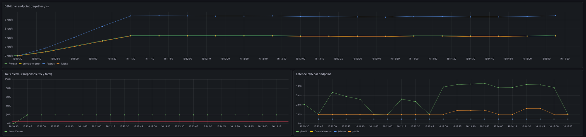

## Étape 7 — Alerte

La règle est dans `prometheus/alerts.yml` :

- **expression :** le même taux d'erreur que le dashboard, `> 0.05` ;
- **`for: 30s` :** il faut que ce soit au-dessus de 5 % pendant 30 secondes. Sans ça, une seule erreur au
  mauvais moment suffirait à déclencher l'alerte.

```
 inactive ──(taux > 5 %)──► pending ──(toujours > 5 % après 30 s)──► firing
     ▲                                                                  │
     └──────────────────────(taux < 5 %)────────────────────────────────┘
```

Pour la tester, `./trafic.sh erreur 90` : 1 requête sur 5 va sur `/simulate-error`, donc environ 20 %
d'erreurs. Ce que j'ai vu :

| Temps | État |
|-------|------|
| 0 s | `inactive` : je lance le trafic |
| + 4 s | `pending` : le taux passe au-dessus de 5 % |
| + 34 s | `firing` : 30 s après |
| + 80 s | j'arrête le trafic |
| + 138 s | `inactive` : environ 1 min après, à cause du `rate(...[1m])` |

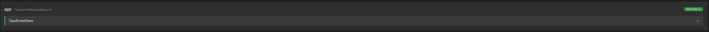

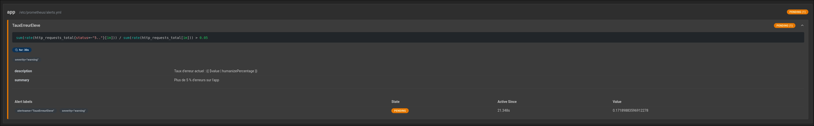

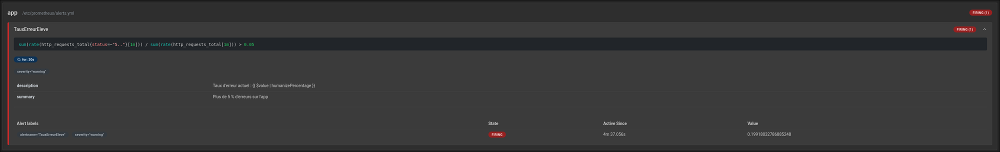

## Étape 8 — README

C'est ce fichier. La partie « En bref » en haut suffit pour relancer la stack et savoir où regarder.
